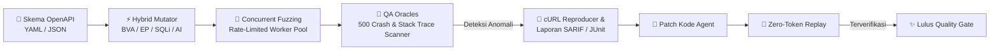

# FuzzSpec (`fuzzspec`)

[](https://go.dev/)
[](#-dukungan-framework-polyglot)
[](https://swagger.io/specification/)
[](https://modelcontextprotocol.io/)
[](https://skills.sh/)
[](./package.json)
[](./LICENSE)

**FuzzSpec** adalah Spec-to-Contract AI Testing Harness, pencegah crash 500 (*500 Crash Preventer*), dan Autonomous Self-Healing Skill Agent berbasis Go yang **100% Polyglot / Language-Agnostic** untuk REST API berbasis OpenAPI (YAML/JSON) di **seluruh bahasa pemrograman** (Go, Python, TypeScript/Node, Java, PHP, Rust, C#/.NET, Ruby).



---

## 🚀 Panduan Memulai Cepat (Quick Start)

### 💬 Metode A: Chat AI Agent via MCP (Direkomendasikan — Semua AI IDE)

Tambahkan FuzzSpec langsung ke AI IDE Anda (Cursor, Claude Desktop, Google Antigravity, Windsurf, Kiro, Continue.dev, dll.) melalui MCP:

```json
{
  "mcpServers": {
    "fuzzspec": {
      "command": "npx",
      "args": [
        "-y",
        "github:hanifalkauni/fuzzspec",
        "--mcp"
      ]
    }
  }
}
```

Sekarang cukup panggil asisten AI Anda secara alami di chat:
> *"@fuzzspec tolong inspeksi spec OpenAPI kita dan lakukan fuzzing pada `/api/v1/orders` untuk mendeteksi potensi crash 500."*  
> *(atau: "setelah saya perbaiki handler-nya, lakukan replay anomaly untuk memastikan bug sudah beres")*

Agent akan secara otonom memanggil tools MCP native (`inspect_spec`, `fuzz_endpoint`, `replay_anomaly`, `scan_and_generate_spec`), mendeteksi runtime panic dan contract drift, memperbaiki kode backend, dan memverifikasi resolusi secara otomatis!

---

### 📄 Metode B: Universal Skill Agent & File Aturan (30+ AI Agents)

Jika Anda ingin panduan prompt/aturan di workspace Anda tanpa background MCP daemon:

#### 🌐 Opsi 1: Otomatis via skills.sh (30+ AI Agents)
Install dengan satu perintah langsung ke Cursor, Claude Code, Windsurf, Copilot, Antigravity, atau Gemini CLI:
```bash
npx skills add hanifalkauni/fuzzspec
```

#### ⚡ Opsi 2: Injeksi Adapter Otomatis via CLI
```bash
# Injeksi ke IDE spesifik:
npx -y github:hanifalkauni/fuzzspec init --ide cursor,claude,copilot,windsurf,antigravity,cline,kiro

# Atau injeksi semua adapter ke repo saat ini:
npx -y github:hanifalkauni/fuzzspec init
```

Perintah ini otomatis membuat:
* 🟢 **Cursor**: `.cursor/rules/fuzzspec.mdc`
* 🟣 **Claude Code**: `CLAUDE.md`
* 🔵 **GitHub Copilot**: `.github/copilot-instructions.md`
* 🌊 **Windsurf**: `.windsurfrules`
* 🤖 **Antigravity**: `.agents/skills/fuzzspec/SKILL.md`
* 🛠️ **Cline**: `.clinerules`
* ⚡ **Kiro**: `.kiro/rules.md`

---

### 🖥️ Metode C: Binary CLI Berkecepatan Tinggi (Lokal & CI/CD)

```bash
# 1. Fuzzing lengkap dengan Auto-Discovery pada framework apa pun
fuzzspec run --target http://localhost:8000 --auto-discover

# 2. Fuzzing dengan file OpenAPI spesifik (YAML atau JSON)
fuzzspec run \
  --spec ./openapi.yaml \
  --target http://localhost:8080 \
  --concurrency 10 \
  --rps 50 \
  --output-sarif ./results.sarif \
  --output-md ./results.md \
  --output-junit ./results.xml

# 3. Mode Replay Deterministik (0 Biaya Token AI)
fuzzspec replay --target http://localhost:8080 --file ./results.json

# 4. Validasi Kesiapan Skema OpenAPI
fuzzspec validate --spec ./openapi.yaml

# 5. Generate Vektor Mutasi Offline (Dry Run)
fuzzspec generate --spec ./openapi.yaml
```

#### 📋 Referensi Perintah & Opsi Flag CLI

| Perintah | Deskripsi | Opsi / Flag Utama |
|---|---|---|
| `fuzzspec validate` | Mem-parsing dan memvalidasi kesiapan spesifikasi OpenAPI 3.0/3.1 (YAML/JSON). | `--spec <file_or_url>` |
| `fuzzspec generate` | Menghasilkan vektor mutasi boundary & adversarial tanpa mengirim request HTTP (dry-run). | `--spec <file>`, `--no-ai`, `--ai-provider` |
| `fuzzspec run` | Menjalankan fuzzing HTTP concurrent dengan QA oracles, pembatas laju (rate limiter), dan laporan multi-format. | `--target <url>`, `--spec <file>`, `--auto-discover`, `--concurrency <N>`, `--rps <N>`, `--safe-mode`, `--output-sarif`, `--output-md`, `--output-junit`, `--output-json` |
| `fuzzspec replay` | Menguji ulang payload anomali yang gagal secara deterministik (**0 biaya token AI**). | `--target <url>`, `--file <report.json>`, `--vector <id>` |
| `fuzzspec init` | Menginjeksi aturan (*rules*) dan adapter skill AI agent ke repositori lokal. | `--ide cursor,claude,copilot,windsurf,antigravity,cline,kiro` |
| `fuzzspec --mcp` | Menjalankan server stdio JSON-RPC 2.0 Model Context Protocol (MCP) untuk AI IDE. | `--mcp` |
| `fuzzspec version` | Menampilkan versi rilis dan info build FuzzSpec. | `--version`, `-v` |


---

## 🌐 Dukungan Framework Polyglot

`FuzzSpec` bekerja pada level **HTTP Contract**, sehingga tidak memerlukan instalasi SDK ke dalam aplikasi Anda:

| Ekosistem | Framework Populer | Auto-Discovery Endpoints |
|---|---|---|
| 🐍 **Python** | FastAPI, Django Ninja, Flask | `/openapi.json`, `/docs` |
| ☕ **Java / Kotlin** | Spring Boot, Quarkus, Micronaut | `/v3/api-docs`, `/v3/api-docs.yaml` |
| 🟨 **Node.js / TS** | NestJS, Express, Fastify | `/api-json`, `/swagger.json` |
| 🐘 **PHP** | Laravel (Scramble/L5), Symfony | `/docs/api.json`, `/api/documentation` |
| 🔷 **C# / .NET** | ASP.NET Core (Swashbuckle) | `/swagger/v1/swagger.json` |
| 🐹 **Go** | Gin, Echo, Fiber, Chi (Swag) | `/swagger/doc.json` |
| 🦀 **Rust** | Actix-Web, Axum (Utoipa) | `/api-docs/openapi.json` |
| 💎 **Ruby** | Ruby on Rails (Rswag) | `/api-docs/v1/swagger.yaml` |

---

## 🏛️ 12 Pilar QA Spec-to-Contract Fuzzing

FuzzSpec dibangun di atas 12 pilar rekayasa untuk mencegah runtime panic 500, kebocoran data, dan menjamin kepatuhan kontrak API tanpa cacat:

| # | Pilar QA | Mekanisme Arsitektur & Tujuan |
|---|---|---|
| **1** | **Spec-to-Contract Ingestion** | Mem-parsing OpenAPI 3.0/3.1 (YAML/JSON) dengan resolusi sirkular `$ref` dan normalisasi hierarki parameter. |
| **2** | **Heuristic Rule Mutator** | Menerapkan Boundary Value Analysis (BVA), Equivalence Partitioning (EP), INT64 overflow, dan buffer string ekstrem. |
| **3** | **Adversarial & Injection Probing** | Menyuntikkan string SQLi, Null byte (`\x00`), CRLF headers, Unicode homoglyph, dan type confusion payload. |
| **4** | **AI Semantic Edge-Case Engine** | Memanfaatkan LLM (Gemini, OpenAI, Claude) untuk mutasi semantik domain spesifik dengan cache vektor lokal. |
| **5** | **Bounded Concurrency Engine** | Worker pool goroutine paralel dengan rate limiter token-bucket (`--rps`) dan timeout ketat per request. |
| **6** | **Safe Mode & Circuit Breaker** | Opsi `--safe-mode=true` membatasi pengujian hanya pada metode read-only (`GET`, `HEAD`, `OPTIONS`) untuk melindungi staging. |
| **7** | **Multi-Layer 500 Crash Oracles** | Membedakan secara otomatis antara respon validasi 4xx yang tertangani vs fatal unhandled 5xx server crash. |
| **8** | **Polyglot Stack Trace Leak Scanner** | Deteksi tanda tangan kebocoran stack trace runtime secara real-time di 8 bahasa (Go, Python, Node, Java, PHP, Rust, C#, Ruby). |
| **9** | **Contract Drift Verification** | Memvalidasi respon server terhadap skema komponen OpenAPI untuk mendeteksi field yang hilang atau salah tipe data. |
| **10** | **Zero-Token Deterministic Replay** | Menguji ulang payload anomali yang gagal di lingkungan lokal untuk memverifikasi perbaikan bug dengan **0 biaya token AI**. |
| **11** | **Enterprise Diagnostics & Exporters** | Menghasilkan laporan SARIF v2.1.0 (GitHub Code Scanning), JUnit XML (CI/CD), Markdown PR comment, dan JSON diagnostik. |
| **12** | **Autonomous Self-Healing Skill** | Native MCP tools dan adapter agen universal untuk Cursor, Claude, Antigravity, Copilot, Windsurf, Cline, dan Kiro. |

---

## 🛠️ Ringkasan Tools MCP

| Nama Tool | Deskripsi | Argumen Utama |
|---|---|---|
| `inspect_spec` | Membedah pohon route OpenAPI, schema parameter, tipe, dan kode response. | `spec_path`, `target_url` |
| `fuzz_endpoint` | Menjalankan fuzzing concurrent (boundary + AI) pada target live dan menghasilkan exact cURL reproducer. | `target_url`, `path`, `method`, `safe_mode`, `ai_enabled` |
| `replay_anomaly` | Menguji ulang payload anomali yang gagal secara deterministik (**0 token AI**). | `target_url`, `report_file`, `vector` |
| `scan_and_generate_spec` | Memindai route kode sumber dan membuat scaffold spesifikasi OpenAPI 3.1. | `project_path`, `output_file`, `output_format` |

---

## 🤖 Integrasi CI/CD GitHub Actions

```yaml
name: API Contract Fuzzing

on: [push, pull_request]

jobs:
  fuzz:
    runs-on: ubuntu-latest
    steps:
      - uses: actions/checkout@v4
      
      - name: Start Target API
        run: npm start & sleep 3

      - name: Run FuzzSpec Quality Gate
        uses: hanifalkauni/fuzzspec@main
        with:
          target: 'http://localhost:3000'
          auto-discover: 'true'
          output-sarif: 'fuzzspec-results.sarif'
          output-md: 'fuzzspec-pr-summary.md'
          output-junit: 'fuzzspec-junit.xml'

      - name: Upload SARIF to GitHub Code Scanning
        uses: github/codeql-action/upload-sarif@v3
        if: always()
        with:
          sarif_file: fuzzspec-results.sarif
```

---

## 🔒 Keamanan & Perlindungan Kredensial (Defense-in-Depth)

FuzzSpec dirancang dengan arsitektur **Zero-Trust AI Security** untuk mencegah kebocoran kredensial atau token rahasia ke dalam riwayat chat AI, jendela konteks prompt, komentar PR CI/CD, maupun repositori publik.

```
┌─────────────────────────────────────────────────────────────────────────────────┐
│                    5 LAPISAN PERLINDUNGAN KREDENSIAL FUZZSPEC                   │
├─────────────────────────────────────────────────────────────────────────────────┤
│ 1. Agent Boundary   : .cursorignore & .claudeignore mengisolasi .env & rahasia  │
│ 2. Scanner Blacklist: Parser mengabaikan .git, .aws, .ssh, *.pem, credentials  │
│ 3. RAM-Only Auth    : token_env membaca token dinamis hanya ke dalam RAM OS     │
│ 4. Stream Redactor  : Otomatis menyensor Bearer token, API key, URI ke REDACTED │
│ 5. Prompt Scrubbing : LLM HANYA menerima tipe skema, TANPA auth/token mentah    │
└─────────────────────────────────────────────────────────────────────────────────┘
```

| Lapisan | Mekanisme | Ruang Lingkup Perlindungan |
|---|---|---|
| **1. Pemblokir Konteks Agent** | [`.cursorignore`](./.cursorignore), [`.claudeignore`](./.claudeignore), [`.gitignore`](./.gitignore) | Memblokir IDE (Cursor, Claude Code, Copilot, Antigravity) dari mengindeks file lokal `.env*`, `credentials.json`, `*.key`, `*.pem`, atau direktori `.aws`. |
| **2. Blacklist Scanner Engine** | `internal/mcp/tools_scan.go` & `internal/parser/discover.go` | Mesin pemindai route dan OpenAPI secara otomatis melompati file dan direktori sensitif. |
| **3. Injeksi Token via RAM-Only** | `token_env: "MY_SECRET_KEY"` | Melarang penulisan token mentah di `fuzzspec.yaml`. Nilai token dibaca langsung dari variabel lingkungan OS saat penembakan HTTP berlangsung. |
| **4. Multi-Pattern Stream Redactor** | `internal/reporter/sanitizer.go` | Semua laporan terminal, file SARIF, komentar PR, dan reproducer cURL menyensor token Bearer, API key cloud (OpenAI, Anthropic, AWS, GitHub), URI database, dan password menjadi `[REDACTED]`. |
| **5. Isolasi Prompt LLM** | `internal/generator/ai_generator.go` | Prompt mutasi yang dikirim ke LLM (Gemini, OpenAI, Claude) **hanya berisi struktur skema OpenAPI** (tipe data, nama field, batasan nilai)—tidak pernah memuat header otentikasi atau data database produksi. |

> [!NOTE]
> **Catatan Operasional untuk cURL Reproducer:**  
> Laporan anomali secara sengaja menghasilkan perintah cURL dengan header `Authorization: Bearer [REDACTED]`. Ketika Anda ingin memverifikasi reproduksi bug secara manual di terminal lokal, cukup ganti teks `[REDACTED]` dengan token aktif Anda.

---

## 🔑 Referensi Variabel Lingkungan (Environment Variables)

FuzzSpec membaca environment variable secara dinamis pada saat eksekusi tanpa hardcoding token:

| Variabel | Tujuan & Deskripsi | Wajib / Opsional |
|---|---|:---:|
| `GEMINI_API_KEY` | Kunci API Google Gemini untuk pengujian mutasi semantik domain AI. | Opsional (Default: Heuristik) |
| `OPENAI_API_KEY` | Kunci API OpenAI untuk model GPT-4o / GPT-4o-mini. | Opsional |
| `ANTHROPIC_API_KEY` | Kunci API Anthropic Claude untuk model Claude 3.5 Sonnet. | Opsional |
| `<CUSTOM_TOKEN_ENV>` | Token otentikasi API target Anda sesuai konfigurasi `token_env`. | Sesuai konfigurasi |

---

## ⚙️ Arsitektur Konfigurasi Deklaratif (`fuzzspec.yaml`)

Anda dapat menyesuaikan seluruh aspek eksekusi, pembatas laju, dan format laporan via file `fuzzspec.yaml`:

```yaml
version: "1"
target: "http://localhost:8000"
spec: "./api/openapi.yaml"     # Kosongkan jika menggunakan auto_discover
auto_discover: true            # Otomatis probe FastAPI, Spring Boot, NestJS, Laravel

execution:
  concurrency: 15              # Jumlah worker goroutine paralel
  rps: 50                      # Rate limiter algoritma token-bucket
  timeout: "5s"                # Batas timeout per request
  retries: 2
  safe_mode: true              # true: hanya GET/HEAD/OPTIONS; false: izinkan POST/PUT/DELETE

authentication:
  type: "bearer"
  token_env: "API_TEST_TOKEN"  # Dibaca dinamis dari RAM / Environment OS
  headers:
    X-Tenant-ID: "qa-sandbox-01"

filtering:
  include_paths: ["/v1/**"]
  exclude_paths: ["/v1/admin/purge"]
  methods: ["GET", "POST", "PUT", "PATCH", "DELETE"]

ai:
  enabled: true
  provider: "gemini"           # gemini | openai | anthropic | local
  model: "gemini-1.5-flash"
  cache_vectors: true

oracles:
  fail_on_5xx: true
  fail_on_schema_drift: true
  scan_info_leak: true
  latency_threshold_ms: 3000

reporting:
  terminal: true
  sarif: "./fuzz-results.sarif"
  junit: "./fuzz-junit.xml"
  markdown: "./fuzz-summary.md"
  json: "./fuzz-results.json"
  sanitize_pii: true
```

---

## ❓ FAQ & Tanya Jawab Teknis

<details>
<summary><b>1. Bagaimana jika aplikasi saya belum memiliki file OpenAPI / Swagger?</b></summary>

Anda tidak perlu membuatnya secara manual! Ada dua opsi otomatis:
* **Opsi A:** Gunakan MCP tool `scan_and_generate_spec` pada AI IDE chat Anda untuk memindai kode sumber route dan menghasilkan file OpenAPI 3.1 yang valid.
* **Opsi B:** Jalankan `fuzzspec run --target http://localhost:8080 --auto-discover`. FuzzSpec akan secara otomatis memindai endpoint dokumentasi bawaan (`/openapi.json`, `/v3/api-docs`, `/api-json`, `/swagger/doc.json`, `/docs/api.json`).
</details>

<details>
<summary><b>2. Mengapa perintah reproduksi cURL berisi <code>Authorization: Bearer [REDACTED]</code>?</b></summary>

Ini adalah fitur sengaja dari **Lapisan 4 (Zero-Trust Output Sanitizer)** untuk memastikan token Anda tidak terekspos jika laporan bug disalin ke GitHub Issues publik, Slack, atau review PR. Cukup ganti teks `[REDACTED]` dengan token aktif Anda saat mereproduksi di terminal lokal.
</details>

<details>
<summary><b>3. Bagaimana cara menguji endpoint destruktif (POST, PUT, DELETE) jika dilewati?</b></summary>

Secara default, FuzzSpec berjalan dalam mode `--safe-mode=true` untuk melindungi lingkungan pengembang. Untuk menguji endpoint pengubah state, tambahkan flag `--safe-mode=false` di CLI atau atur `safe_mode: false` di `fuzzspec.yaml`. **Pastikan Anda selalu menargetkan database pengujian (test/staging).**
</details>

<details>
<summary><b>4. Bagaimana cara kerja replay deterministik dengan 0 biaya token AI?</b></summary>

Ketika `fuzz_endpoint` atau `fuzzspec run` menemukan anomali, vektor request HTTP persis dicatat ke dalam file `results.json`. Menjalankan `fuzzspec replay --file results.json` akan menembakkan kembali payload yang gagal tersebut langsung ke server tanpa memanggil API LLM pihak ketiga.
</details>

---

## 📑 Dokumentasi Terkait

- 🛡️ **[Kebijakan Keamanan & Model Ancaman (docs/SECURITY.id.md)](./docs/SECURITY.id.md)** — Arsitektur Zero-Trust, mitigasi DoS/SSRF, dan checklist sebelum deploy.
- 🤝 **[Panduan Kontribusi (docs/CONTRIBUTING.id.md)](./docs/CONTRIBUTING.id.md)** — Setup pengembang, menjalankan test suite & pedoman pull request.
- 🛠️ **[Panduan Ekstensi Bahasa (docs/EXTENDING_LANGUAGES.md)](./docs/EXTENDING_LANGUAGES.md)** — Mendaftarkan framework kustom via YAML.
- ⚙️ **[Contoh Konfigurasi (fuzzspec.example.yaml)](./fuzzspec.example.yaml)** — Template konfigurasi deklaratif.
- 🧠 **[Playbook Agent Skill (SKILL.md)](./SKILL.md)** — Panduan prompt autonomous self-healing.

---

## 📜 Lisensi (License)

```text
SPDX-License-Identifier: Apache-2.0
```

Proyek ini dilisensikan di bawah **Apache License 2.0**. Lihat file [`LICENSE`](./LICENSE) untuk informasi selengkapnya.


