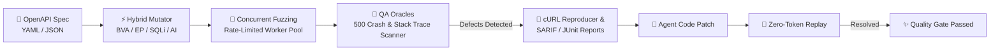

# FuzzSpec (`fuzzspec`)

[](https://go.dev/)
[](#-supported-polyglot-frameworks)
[](https://swagger.io/specification/)
[](https://modelcontextprotocol.io/)
[](https://skills.sh/)
[](./package.json)
[](./LICENSE)

**FuzzSpec** is a language-agnostic, spec-to-contract AI testing harness, 500 crash preventer, and autonomous self-healing skill agent for OpenAPI (YAML/JSON) REST APIs across **all programming languages** (Go, Python, TypeScript/Node, Java, PHP, Rust, C#/.NET, Ruby).



---

## 🚀 Quick Start

### 💬 Method A: AI Agent Chat via MCP (Recommended — Any AI IDE)

Add FuzzSpec directly to your AI IDE (Cursor, Claude Desktop, Google Antigravity, Windsurf, Kiro, Continue.dev, etc.) via MCP:

```json
{
  "mcpServers": {
    "fuzzspec": {
      "command": "npx",
      "args": [
        "-y",
        "github:hanifalkauni/fuzzspec",
        "--mcp"
      ]
    }
  }
}
```

Now prompt your AI assistant naturally in chat:
> *"@fuzzspec inspect our OpenAPI spec and run focused fuzzing on `/api/v1/orders` to check for 500 crashes."*  
> *(or: "after updating the handler, replay the failing payload to verify the fix")*

The agent autonomously invokes the native MCP tools (`inspect_spec`, `fuzz_endpoint`, `replay_anomaly`, `scan_and_generate_spec`), detects unhandled runtime panics and contract drift, patches the backend code, and verifies resolution—**zero manual effort!**

---

### 📄 Method B: Universal Skill Agent & Rule File (30+ AI Agents)

If you prefer pure prompt/rule guidance in your workspace without a background MCP daemon:

#### 🌐 Option 1: Automatic via skills.sh (30+ AI Agents)
Install with a single command directly into Cursor, Claude Code, Windsurf, Copilot, Antigravity, or Gemini CLI:
```bash
npx skills add hanifalkauni/fuzzspec
```

#### ⚡ Option 2: Automatic Adapter Injection via CLI
```bash
# Inject into specific IDEs:
npx -y github:hanifalkauni/fuzzspec init --ide cursor,claude,copilot,windsurf,antigravity,cline,kiro

# Or inject all adapters into current repo:
npx -y github:hanifalkauni/fuzzspec init
```

This generates:
* 🟢 **Cursor**: `.cursor/rules/fuzzspec.mdc`
* 🟣 **Claude Code**: `CLAUDE.md`
* 🔵 **GitHub Copilot**: `.github/copilot-instructions.md`
* 🌊 **Windsurf**: `.windsurfrules`
* 🤖 **Antigravity**: `.agents/skills/fuzzspec/SKILL.md`
* 🛠️ **Cline**: `.clinerules`
* ⚡ **Kiro**: `.kiro/rules.md`

---

### 🖥️ Method C: Native High-Performance CLI (Local & CI/CD)

```bash
# 1. Full Fuzzing with Auto-Discovery on any framework (e.g. FastAPI / Spring Boot)
fuzzspec run --target http://localhost:8000 --auto-discover

# 2. Explicit OpenAPI Spec Fuzzing (YAML or JSON)
fuzzspec run \
  --spec ./openapi.yaml \
  --target http://localhost:8080 \
  --concurrency 10 \
  --rps 50 \
  --output-sarif ./results.sarif \
  --output-md ./results.md \
  --output-junit ./results.xml

# 3. Deterministic Replay Mode (Zero AI Cost)
fuzzspec replay --target http://localhost:8080 --file ./results.json

# 4. Validate Spec Readiness
fuzzspec validate --spec ./openapi.yaml

# 5. Generate Vectors Offline (Dry Run)
fuzzspec generate --spec ./openapi.yaml
```

#### 📋 CLI Command & Flags Reference

| Command | Description | Key Flags / Options |
|---|---|---|
| `fuzzspec validate` | Parses and validates OpenAPI 3.0/3.1 (YAML/JSON) specification readiness. | `--spec <file_or_url>` |
| `fuzzspec generate` | Generates boundary, heuristic & adversarial test vectors without making HTTP calls (dry-run). | `--spec <file>`, `--no-ai`, `--ai-provider` |
| `fuzzspec run` | Executes concurrent HTTP fuzzing with QA oracles, rate limiting, and multi-format reports. | `--target <url>`, `--spec <file>`, `--auto-discover`, `--concurrency <N>`, `--rps <N>`, `--safe-mode`, `--output-sarif`, `--output-md`, `--output-junit`, `--output-json` |
| `fuzzspec replay` | Deterministically re-executes failing anomaly payloads to verify bug fixes (**0 AI token cost**). | `--target <url>`, `--file <report.json>`, `--vector <id>` |
| `fuzzspec init` | Automatically scaffolds AI agent rules and skill adapters into the repository. | `--ide cursor,claude,copilot,windsurf,antigravity,cline,kiro` |
| `fuzzspec --mcp` | Starts the Model Context Protocol (MCP) JSON-RPC 2.0 stdio server for AI IDEs. | `--mcp` |
| `fuzzspec version` | Prints FuzzSpec version and build info. | `--version`, `-v` |


---

## 🌐 Supported Polyglot Frameworks

`FuzzSpec` operates at the **HTTP Contract layer**, requiring zero SDK installations:

| Ecosystem | Popular Frameworks | Auto-Discovery Endpoints |
|---|---|---|
| 🐍 **Python** | FastAPI, Django Ninja, Flask | `/openapi.json`, `/docs` |
| ☕ **Java / Kotlin** | Spring Boot, Quarkus, Micronaut | `/v3/api-docs`, `/v3/api-docs.yaml` |
| 🟨 **Node.js / TS** | NestJS, Express, Fastify | `/api-json`, `/swagger.json` |
| 🐘 **PHP** | Laravel (Scramble/L5), Symfony | `/docs/api.json`, `/api/documentation` |
| 🔷 **C# / .NET** | ASP.NET Core (Swashbuckle) | `/swagger/v1/swagger.json` |
| 🐹 **Go** | Gin, Echo, Fiber, Chi (Swag) | `/swagger/doc.json` |
| 🦀 **Rust** | Actix-Web, Axum (Utoipa) | `/api-docs/openapi.json` |
| 💎 **Ruby** | Ruby on Rails (Rswag) | `/api-docs/v1/swagger.yaml` |

---

## 🏛️ The 12 QA Pillars of Spec-to-Contract Fuzzing

FuzzSpec is built upon 12 engineering pillars designed to eliminate unhandled backend panics, prevent data leakage, and guarantee zero-defect API contracts:

| # | QA Pillar | Architectural Mechanism & Purpose |
|---|---|---|
| **1** | **Spec-to-Contract Ingestion** | Ingests OpenAPI 3.0/3.1 (YAML/JSON) with full `$ref` circular resolution and parameter hierarchy normalization. |
| **2** | **Deterministic Heuristic Mutator** | Applies Boundary Value Analysis (BVA), Equivalence Partitioning (EP), INT64 overflows, and buffer stress mutations. |
| **3** | **Adversarial & Injection Probing** | Injects SQLi strings, Null bytes (`\x00`), CRLF headers, Unicode homoglyphs, and type confusion payloads. |
| **4** | **AI Semantic Edge-Case Engine** | Uses LLMs (Gemini, OpenAI, Claude) for contextual domain-specific edge cases with local vector caching. |
| **5** | **Bounded Concurrency Engine** | Concurrent goroutine worker pool with token-bucket rate limiting (`--rps`) and strict per-request timeouts. |
| **6** | **Safe Mode & Circuit Breaker** | `--safe-mode=true` restricts fuzzing to read-only methods (`GET`, `HEAD`, `OPTIONS`) to protect staging environments. |
| **7** | **Multi-Layer 500 Crash Oracles** | Automatically differentiates between clean handled 4xx validations and fatal unhandled 5xx server crashes. |
| **8** | **Polyglot Stack Trace Leak Scanner** | Real-time signature detection for leaked runtime stack traces across 8 languages (Go, Python, Node, Java, PHP, Rust, C#, Ruby). |
| **9** | **Contract Drift Verification** | Validates response payloads against OpenAPI component schemas to catch missing fields and type mismatches. |
| **10** | **Zero-Token Deterministic Replay** | Re-executes failing anomaly payloads locally to verify bug fixes with **0 AI token cost**. |
| **11** | **Enterprise Diagnostics & Exporters** | Generates SARIF v2.1.0 (GitHub Code Scanning), JUnit XML (CI/CD), Markdown PR comments, and JSON diagnostics. |
| **12** | **Autonomous Self-Healing Skill** | Native MCP tools and universal agent adapters for Cursor, Claude, Antigravity, Copilot, Windsurf, Cline, and Kiro. |

---

## 🛠️ MCP Tools Overview

| Tool Name | Description | Key Arguments |
|---|---|---|
| `inspect_spec` | Parses OpenAPI spec tree, schemas, types, and documented response codes. | `spec_path`, `target_url` |
| `fuzz_endpoint` | Runs concurrent boundary, adversarial, and AI fuzzing against a live server. Returns exact cURL reproducers. | `target_url`, `path`, `method`, `safe_mode`, `ai_enabled` |
| `replay_anomaly` | Deterministically re-tests failing payloads to verify bug fixes (**0 AI token cost**). | `target_url`, `report_file`, `vector` |
| `scan_and_generate_spec` | Scans codebase routes and scaffolds an OpenAPI 3.1 specification. | `project_path`, `output_file`, `output_format` |

---

## 🤖 GitHub Actions CI/CD Integration

```yaml
name: API Contract Fuzzing

on: [push, pull_request]

jobs:
  fuzz:
    runs-on: ubuntu-latest
    steps:
      - uses: actions/checkout@v4
      
      - name: Start Target API
        run: npm start & sleep 3

      - name: Run FuzzSpec Quality Gate
        uses: hanifalkauni/fuzzspec@main
        with:
          target: 'http://localhost:3000'
          auto-discover: 'true'
          output-sarif: 'fuzzspec-results.sarif'
          output-md: 'fuzzspec-pr-summary.md'
          output-junit: 'fuzzspec-junit.xml'

      - name: Upload SARIF to GitHub Code Scanning
        uses: github/codeql-action/upload-sarif@v3
        if: always()
        with:
          sarif_file: fuzzspec-results.sarif
```

---

## 🔒 Security & Credential Protection (Defense-in-Depth)

FuzzSpec is engineered with **Zero-Trust AI Security** to prevent credential leakage into AI chat logs, prompt context windows, CI/CD comments, or public repositories.

```
┌─────────────────────────────────────────────────────────────────────────────────┐
│                    5-LAYER CREDENTIAL PROTECTION PIPELINE                       │
├─────────────────────────────────────────────────────────────────────────────────┤
│ 1. Agent Boundary   : .cursorignore & .claudeignore isolate .env / secrets      │
│ 2. Scanner Blacklist: Parser ignores .git, .aws, .ssh, *.pem, credentials.json  │
│ 3. RAM-Only Auth    : token_env dynamically resolves keys into OS RAM only     │
│ 4. Stream Redactor  : Auto-sanitizes Bearer tokens, API keys, DB URIs to REDACTED │
│ 5. Prompt Scrubbing : LLM only receives schema types, NEVER raw auth or tokens   │
└─────────────────────────────────────────────────────────────────────────────────┘
```

| Layer | Mechanism | Protection Scope |
|---|---|---|
| **1. Agent Context Blocker** | [`.cursorignore`](./.cursorignore), [`.claudeignore`](./.claudeignore), [`.gitignore`](./.gitignore) | Blocks IDEs (Cursor, Claude Code, Copilot, Antigravity) from indexing local `.env*`, `credentials.json`, `*.key`, `*.pem`, or `.aws` files. |
| **2. Engine Scanner Blacklist** | `internal/mcp/tools_scan.go` & `internal/parser/discover.go` | Route and OpenAPI discovery engines reject scanning sensitive directories and secret files. |
| **3. RAM-Only Secret Injection** | `token_env: "MY_SECRET_KEY"` | Prohibits saving raw tokens in `fuzzspec.yaml`. Tokens are fetched directly from OS environment variables at HTTP execution time. |
| **4. Multi-Pattern Stream Redactor** | `internal/reporter/sanitizer.go` | All reports, terminal logs, SARIF files, PR comments, and cURL reproducers mask Bearer tokens, cloud API keys (OpenAI, Anthropic, AWS, GitHub), DB connection strings, and passwords as `[REDACTED]`. |
| **5. AI Prompt Isolation** | `internal/generator/ai_generator.go` | Mutation prompts sent to LLMs (Gemini, OpenAI, Claude) contain **only OpenAPI schema shapes** (types, field names, constraints)—never authorization headers or live database records. |

> [!NOTE]
> **Operational Trade-off on cURL Reproducers:**  
> Bug reports intentionally generate cURL commands with `Authorization: Bearer [REDACTED]`. When manually verifying a reproduction in your local terminal, simply replace `[REDACTED]` with your active test token.

---

## 🔑 Environment Variables Reference

FuzzSpec reads environment variables dynamically at execution time with zero hardcoding:

| Variable | Purpose & Description | Required / Optional |
|---|---|:---:|
| `GEMINI_API_KEY` | Google Gemini API key for AI-assisted semantic edge-case fuzzing. | Optional (Default: Heuristic) |
| `OPENAI_API_KEY` | OpenAI API key for GPT-4o / GPT-4o-mini fuzzing vectors. | Optional |
| `ANTHROPIC_API_KEY` | Anthropic Claude API key for Claude 3.5 Sonnet mutations. | Optional |
| `<CUSTOM_TOKEN_ENV>` | Target API authentication token referenced dynamically via `token_env`. | As configured |

---

## ⚙️ Declarative Configuration (`fuzzspec.yaml`)

You can customize all aspects of execution, rate limiting, and reporting via a declarative `fuzzspec.yaml` file:

```yaml
version: "1"
target: "http://localhost:8000"
spec: "./api/openapi.yaml"     # Omit if using auto_discover
auto_discover: true            # Automatically probes FastAPI, Spring, NestJS, Laravel

execution:
  concurrency: 15              # Parallel worker threads
  rps: 50                      # Token-bucket rate limiter
  timeout: "5s"                # Per-request timeout
  retries: 2
  safe_mode: true              # true: only GET/HEAD/OPTIONS; false: allow POST/PUT/DELETE

authentication:
  type: "bearer"
  token_env: "API_TEST_TOKEN"  # Dynamically read from RAM / OS env
  headers:
    X-Tenant-ID: "qa-sandbox-01"

filtering:
  include_paths: ["/v1/**"]
  exclude_paths: ["/v1/admin/purge"]
  methods: ["GET", "POST", "PUT", "PATCH", "DELETE"]

ai:
  enabled: true
  provider: "gemini"           # gemini | openai | anthropic | local
  model: "gemini-1.5-flash"
  cache_vectors: true

oracles:
  fail_on_5xx: true
  fail_on_schema_drift: true
  scan_info_leak: true
  latency_threshold_ms: 3000

reporting:
  terminal: true
  sarif: "./fuzz-results.sarif"
  junit: "./fuzz-junit.xml"
  markdown: "./fuzz-summary.md"
  json: "./fuzz-results.json"
  sanitize_pii: true
```

---

## ❓ FAQ & Troubleshooting

<details>
<summary><b>1. What if my API does not have an existing OpenAPI / Swagger specification?</b></summary>

You don't need to write one manually! You have two automatic options:
* **Option A:** Use the MCP tool `scan_and_generate_spec` in your AI IDE chat to scan your route source code and scaffold a valid OpenAPI 3.1 file.
* **Option B:** Run `fuzzspec run --target http://localhost:8080 --auto-discover`. FuzzSpec will automatically probe standard documentation endpoints (`/openapi.json`, `/v3/api-docs`, `/api-json`, `/swagger/doc.json`, `/docs/api.json`).
</details>

<details>
<summary><b>2. Why do cURL reproduction commands contain <code>Authorization: Bearer [REDACTED]</code>?</b></summary>

This is an intentional feature of **Layer 4 (Zero-Trust Output Sanitizer)**. It guarantees that if you copy-paste bug reports into public GitHub Issues, Slack channels, or PR reviews, your active tokens are never exposed. Simply replace `[REDACTED]` with your live test token when manually replaying in your terminal.
</details>

<details>
<summary><b>3. How do I fuzz destructive endpoints (POST, PUT, DELETE) if they are skipped?</b></summary>

By default, FuzzSpec runs in `--safe-mode=true` to protect developer environments. To test state-changing endpoints, pass `--safe-mode=false` in the CLI or set `safe_mode: false` in `fuzzspec.yaml`. **Always ensure you are targeting a disposable test or staging database.**
</details>

<details>
<summary><b>4. How does deterministic replay work with 0 AI token cost?</b></summary>

When `fuzz_endpoint` or `fuzzspec run` discovers an anomaly, it records the exact HTTP request vector into `results.json`. Running `fuzzspec replay --file results.json` re-executes the exact offending payload directly against the server, verifying your bug fix without invoking external LLMs.
</details>

---

## 📑 Additional Documentation

- 🛡️ **[Security Policy & Threat Model (SECURITY.md)](./SECURITY.md)** — Zero-Trust architecture, threat modeling & pre-flight checklist.
- 🤝 **[Contributing Guide (CONTRIBUTING.md)](./CONTRIBUTING.md)** — Developer setup, running tests & pull request guidelines.
- 🛠️ **[Custom Language Guide (docs/EXTENDING_LANGUAGES.md)](./docs/EXTENDING_LANGUAGES.md)** — Register custom frameworks via YAML.
- ⚙️ **[Example Configuration (fuzzspec.example.yaml)](./fuzzspec.example.yaml)** — Declarative YAML configuration template.
- 🧠 **[Agent Skill Playbook (SKILL.md)](./SKILL.md)** — Autonomous self-healing prompt playbook.

---

## 📜 License

```text
SPDX-License-Identifier: Apache-2.0
```

This project is licensed under the **Apache License 2.0**. See the [`LICENSE`](./LICENSE) file for details.


