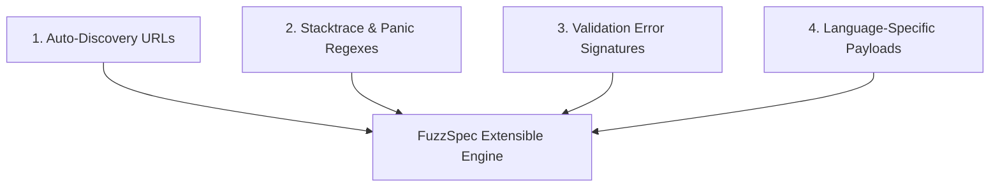

# 🛠️ Panduan Menambahkan Bahasa & Framework Pemrograman Kustom (Custom Language Extension Guide)

`FuzzSpec` didesain dengan prinsip **Extensible Architecture**. Jika bahasa pemrograman atau framework yang Anda gunakan belum ada dalam daftar bawaan (*built-in*), Anda dapat menambahkannya sendiri dengan sangat mudah melalui file konfigurasi deklaratif **tanpa perlu mengubah kode sumber Go atau melakukan recompile binary**.

---

## 📑 Daftar Isi
1. [Konsep Dasar Ekstensibilitas](#1-konsep-dasar-ekstensibilitas)
2. [Struktur Konfigurasi Bahasa Kustom](#2-struktur-konfigurasi-bahasa-kustom)
3. [Langkah Demi Langkah (Step-by-Step)](#3-langkah-demi-langkah-step-by-step)
4. [Contoh Implementasi Nyata](#4-contoh-implementasi-nyata)
   - [Contoh 1: Elixir (Phoenix Framework)](#contoh-1-elixir-phoenix-framework)
   - [Contoh 2: Kotlin / Ktor](#contoh-2-kotlin--ktor)
   - [Contoh 3: In-House / Proprietary Framework](#contoh-3-in-house--proprietary-framework)
5. [Validasi & Uji Coba Konfigurasi](#5-validasi--uji-coba-konfigurasi)

---

## 1. Konsep Dasar Ekstensibilitas

Ketika `FuzzSpec` menguji sebuah target API, ada 4 komponen utama yang dapat Anda kustomisasi untuk bahasa/framework baru:



1. **Auto-Discovery Endpoints:** Di mana endpoint OpenAPI JSON/YAML framework Anda berada.
2. **Crash & Stack Trace Signatures (Regex):** Pola teks yang menandakan runtime aplikasi Anda mengalami panic/unhandled crash (misal: `** (RuntimeError)` pada Elixir).
3. **Handled Validation Error Formats:** Pola respons JSON ketika framework Anda berhasil memvalidasi error secara aman (misal format respon `422/400` bawaan).
4. **Custom Payloads (Opsional):** Karakter anomali unik yang sering membuat runtime tersebut crash (misal: *atom limit exhaustion* pada Erlang/BEAM).

---

## 2. Struktur Konfigurasi Bahasa Kustom

Anda dapat mendefinisikan bahasa baru di file `fuzzspec.yaml` atau di folder `.fuzzspec/languages/*.yaml`:

```yaml
custom_languages:
  - name: "elixir-phoenix"
    display_name: "Elixir / Phoenix Framework"
    
    # 1. Endpoint auto-discovery OpenAPI bawaan library (e.g. Phoenix Swagger / OpenApiSpex)
    discovery_endpoints:
      - "/api/openapi"
      - "/swagger/doc.json"
      - "/api/v1/swagger.json"

    # 2. Pola Regex untuk mendeteksi unhandled crash / exception / panic
    stacktrace_patterns:
      - '(?i)\*\*\s*\([a-zA-Z0-9\._]+Error\)'               # Contoh: ** (RuntimeError) atau ** (ArgumentError)
      - '(?i)\[error\]\s*GenServer\s+.*terminating'         # Crash pada OTP process
      - '(?i)Ecto\.NoResultsError'                          # Unhandled DB exception
      - '(?i)\(Plug\.Conn\.WrapperError\)'

    # 3. Format error validasi yang dianggap sukses (Handled 4xx, bukan bug)
    validation_error_signatures:
      - '{"errors":\s*{'                                   # Format changeset bawaan Phoenix Ecto
      - '{"error":\s*"'

    # 4. Payload uji batas khusus karakteristik bahasa ini (Opsional)
    language_specific_payloads:
      - name: "atom_table_overflow_attempt"
        type: "string"
        value: "very_long_nonexistent_atom_string_1234567890"
```

---

## 3. Langkah Demi Langkah (Step-by-Step)

### Langkah 1: Buat File Konfigurasi
Buat file `fuzzspec.yaml` di root proyek Anda atau letakkan di `.fuzzspec/languages/my-framework.yaml`.

### Langkah 2: Identifikasi Endpoint OpenAPI
Ketahui URL di mana framework Anda memaparkan OpenAPI specification:
- Contoh: Jika framework Anda merender OpenAPI di `http://localhost:4000/api/openapi`, masukkan `/api/openapi` ke `discovery_endpoints`.

### Langkah 3: Identifikasi Format Stack Trace
Cari tahu bagaimana runtime Anda menampilkan error jika terjadi unhandled crash:
- Coba buat error manual (misal membagi dengan nol atau mengakses index null).
- Ambil pola teks khas error tersebut dan ubah menjadi pola **Regular Expression (Regex)**.

### Langkah 4: Tentukan Format Handled Error (400/422)
Pastikan respons validasi normal tidak dianggap sebagai error tak terduga.

---

## 4. Contoh Implementasi Nyata

### Contoh 1: Elixir (Phoenix Framework)
Tambahkan ke `fuzzspec.yaml`:
```yaml
custom_languages:
  - name: "elixir-phoenix"
    discovery_endpoints:
      - "/api/openapi.json"
      - "/swagger.json"
    stacktrace_patterns:
      - '\*\*\s*\([A-Za-z0-9\._]+Error\)'
      - 'Plug\.Conn\.WrapperError'
      - 'Postgrex\.Error'
    validation_error_signatures:
      - '{"errors":'
```

### Contoh 2: Kotlin / Ktor
```yaml
custom_languages:
  - name: "kotlin-ktor"
    discovery_endpoints:
      - "/openapi/documentation.yaml"
      - "/swagger/v1.json"
    stacktrace_patterns:
      - 'io\.ktor\.server\.plugins\.CannotTransformContentToTypeException'
      - 'java\.lang\.NullPointerException'
      - 'kotlin\.UninitializedPropertyAccessException'
    validation_error_signatures:
      - '{"status":"BAD_REQUEST"'
      - '{"error":'
```

### Contoh 3: In-House / Proprietary Enterprise Gateway
Jika kantor Anda memiliki microservice framework internal:
```yaml
custom_languages:
  - name: "enterprise-core-v2"
    discovery_endpoints:
      - "/internal/schema/v2"
      - "/_mgmt/contract.json"
    stacktrace_patterns:
      - 'FATAL_CORE_PANIC:'
      - 'ERR_UNHANDLED_GATEWAY_CRASH'
      - 'DB_CONNECTION_POOL_LEAK'
    validation_error_signatures:
      - '{"meta":{"code":400'
      - '{"meta":{"code":422'
```

---

## 5. Validasi & Uji Coba Konfigurasi

Untuk memverifikasi bahwa konfigurasi bahasa baru Anda valid dan siap dijalankan:

```bash
# 1. Validasi sintaks file konfigurasi bahasa
fuzzspec validate-config --config ./fuzzspec.yaml

# 2. Jalankan fuzzing dengan bahasa kustom
fuzzspec run \
  --config ./fuzzspec.yaml \
  --target http://localhost:4000 \
  --auto-discover
```

Jika target server mengalami crash yang cocok dengan pola regex yang Anda daftarkan, `fuzzspec` akan langsung menandainya sebagai **CRITICAL ANOMALY (FAIL)** dan menyertakan cURL reproducer lengkap di terminal serta laporan CI/CD!
